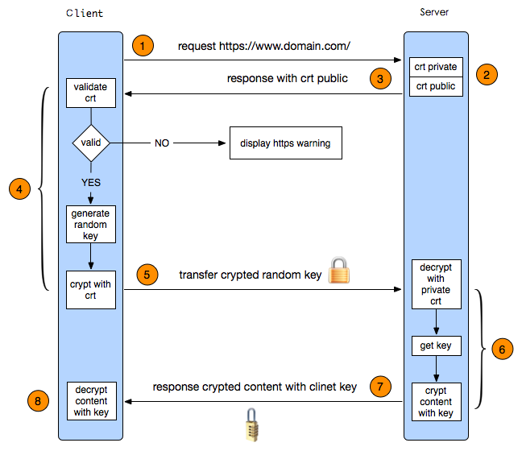

## 后端开发-腾讯
### 1. 手撕1：合并K个升序链表
#### 顺序法

##### 算法描述：
最朴素的方法：用一个变量 ans 来维护以及合并的链表，第 i 次循环把第 i 个链表和 ans 合并，答案保存到 ans 中。

##### 复杂度分析：
时间复杂度：假设每个链表的最长长度是 n。在第一次合并后，ans 的长度为 n；第二次合并后，ans 的长度为$2×n$，第 i 次合并后，ans 的长度为 i×n。第 i 次合并的时间代价是 $O(n+(i−1)×n)=O(i×n)$，那么总的时间代价为$ O(\sum_{i=1}^{k}(i×n))=O( \frac{(1+k)⋅k}{2}×n)=O(k^{2}n)$，故渐进时间复杂度为$O(k^{2}n)$。

#### 分治合并
##### 算法描述：
考虑优化方法一，用分治的方法进行合并。

- 将 k 个链表配对并将同一对中的链表合并；
- 第一轮合并以后，k 个链表被合并成了 2k 个链表，平均长度为 $\frac{n}{2}$，然后是 $4k$ 个链表，$8k$ 个链表等等；
- 重复这一过程，直到我们得到了最终的有序链表。

##### 复杂度分析：
考虑递归「向上回升」的过程——

- 第一轮合并 $2k$ 组链表，每一组的时间代价是 $O(2n)$；
- 第二轮合并 $4k$ 组链表，每一组的时间代价是 $O(4n)$；
  
......所以总的时间代价是 $O\left(\sum_{i=1}^{\infty} \frac{2^i}{k} \times 2^i n\right) = O(kn \times \log k)$。

故渐进时间复杂度为 $O(kn \times \log k)$。

递归会使用到 $O(\log k)$ 空间代价的栈空间。

#### 优先队列
``` java
class Solution {
    class Status implements Comparable<Status>{
        int val;
        ListNode ptr;
        
        public Status(int val, ListNode ptr){
            this.val = val;
            this.ptr = ptr;
        }

        public int compareTo(Status status2){
            return this.val - status2.val;
        }

    }

    PriorityQueue<Status> queue = new PriorityQueue<Status>();

    public ListNode mergeKLists(ListNode[] lists){
        for(ListNode node : lists){
            if(node!=null){
                queue.offer(new Status(node.val, node));
            }
        }
        ListNode head = new ListNode(0);
        ListNode tail = head;

        while(!queue.isEmpty()){
            Status f = queue.poll();
            tail.next = f.ptr;
            tail = tail.next;
            if(f.ptr.next != null){
                queue.offer(new Status(f.ptr.next.val, f.ptr.next));
            }
        }
        return head.next;
    }
}
```
时间复杂度：考虑优先队列中的元素不超过 k 个，那么插入和删除的时间代价为 O(logk)，这里最多有 kn 个点，对于每个点都被插入删除各一次，故总的时间代价即渐进时间复杂度为 O(kn×logk)。
空间复杂度：这里用了优先队列，优先队列中的元素不超过 k 个，故渐进空间复杂度为 O(k)。


### 2. 手撕2：数组中第K个最大元素
#### 基于快速排序的选择方法
##### 算法描述：
由此可以发现每次经过「划分」操作后，我们一定可以确定一个元素的最终位置，即 x 的最终位置为 q，并且保证 a[l⋯q−1] 中的每个元素小于等于 a[q]，且 a[q] 小于等于 a[q+1⋯r] 中的每个元素。所以只要某次划分的 q 为倒数第 k 个下标的时候，我们就已经找到了答案。 我们只关心这一点，至于 a[l⋯q−1] 和 a[q+1⋯r] 是否是有序的，我们不关心
##### 时间复杂度分析：
时间复杂度：O(n)，如上文所述，证明过程可以参考「《算法导论》9.2：期望为线性的选择算法」。
空间复杂度：O(logn)，递归使用栈空间的空间代价的期望为 O(logn)。

#### 基于堆排序的选择方法
##### 算法描述：
我们也可以使用堆排序来解决这个问题——建立一个大根堆，做 k−1 次删除操作后堆顶元素就是我们要找的答案。在很多语言中，都有优先队列或者堆的的容器可以直接使用，但是在面试中，面试官更倾向于让更面试者自己实现一个堆。所以建议读者掌握这里大根堆的实现方法，在这道题中尤其要搞懂「建堆」、「调整」和「删除」的过程。
##### 时间复杂度分析
时间复杂度：O(nlogn)，建堆的时间代价是 O(n)，删除的总代价是 O(klogn)，因为 k<n，故渐进时间复杂为 O(n+klogn)=O(nlogn)。
空间复杂度：O(logn)，即递归使用栈空间的空间代价。

### 3. MySQL查询时，具体有哪些操作，哪些操作最耗时
MySQL查询的操作：
查询解析  &rarr; 查询优化  &rarr; 执行计划生成  &rarr; 数据读取 &rarr; 连接操作  &rarr; 排序操作  &rarr; 聚合操作 &rarr; 临时表的使用  &rarr; 锁机制  &rarr; 网络传输

其中，比较耗时的是数据读取操作，如果一个数据不在缓存中，MySQL需要从磁盘中读取数据，这会导致较慢的查询响应时间。同时，如果没有命中索引，也可能触发全表扫描，导致大量的IO操作

在临时表的使用中，如果临时表的数据量比较大，无法放入内存中，则会写入硬盘中，显著增加查询时间，临时表的创建，存储，销毁都会比较耗时

GPT模拟出来的MySQL查询执行时间表格
| 操作步骤                                  | 描述                                                  | 假设耗时（毫秒）  | 备注                                   |
| ------------------------------------- | --------------------------------------------------- | --------- | ------------------------------------ |
| **查询解析（Parsing）**                     | SQL 语法解析、检查是否有语法错误                                  | 1-10 ms   | 对于简单查询通常很快，但复杂查询可能稍慢                 |
| **查询优化（Optimization）**                | 优化器选择最佳的执行计划                                        | 1-20 ms   | 大查询可能需要更多时间来选择最佳计划，尤其是没有合适索引时        |
| **执行计划生成（Execution Plan Generation）** | 根据优化器的选择生成执行计划（例如选择索引、连接顺序）                         | 5-50 ms   | 如果查询涉及复杂的 JOIN 或子查询，可能会更长            |
| **数据读取（Data Retrieval）**              | 从磁盘或缓存读取数据，依赖于是否使用缓存、表的大小和索引的效率                     | 10-200 ms | 如果缓存命中，通常较快；没有索引或大表则可能导致较慢的磁盘 I/O 读取 |
| **连接操作（Join）**                        | 多表连接，涉及的表越多，数据量越大，连接操作越复杂，所需时间越长                    | 50-500 ms | 外连接通常比内连接耗时，特别是没有索引时需要全表扫描           |
| **排序操作（Sorting）**                     | 对查询结果进行排序（例如 `ORDER BY`）                            | 20-500 ms | 如果数据量大并且没有索引，排序会涉及大量的内存或磁盘操作         |
| **聚合操作（Aggregation）**                 | 执行 `GROUP BY`、`COUNT`、`SUM` 等聚合操作                   | 50-500 ms | 聚合操作需要扫描大量数据，特别是没有索引时会增加查询时间         |
| **临时表使用（Temporary Tables）**           | 对于复杂查询（如 `GROUP BY`、`DISTINCT`、`ORDER BY`），可能会创建临时表 | 50-500 ms | 如果临时表无法完全放入内存，会写入磁盘，导致更长的延迟          |
| **锁机制（Locking）**                      | 查询过程中可能会加锁，尤其是在事务处理中或多个查询并发时                        | 10-200 ms | 锁竞争时可能导致查询阻塞，特别是在高并发环境中              |
| **网络传输（Network Latency）**             | 查询结果从数据库传输到客户端                                      | 5-100 ms  | 如果查询结果集非常大，网络传输会成为瓶颈                 |


### 4. MySQL的单表上限是2kw，这个是怎么算出来的
对于B+树索引来说，假设：
- 非叶子节点内指向其他页的数量为 x
- 叶子节点内能容纳的数据行数为 y
- B+ 数的层数为 z

那么$Total = x^{(z-1)} * y$,也就是说总数会等于 x 的 z-1 次方 与 Y 的乘积。

对于每一个页面来说，可以存放数据的大小是15kb
#### 关于x的取值
主键假设是Bigint(8byte)，页号也是固定的（4byte），那么索引页中一条数据就是12byte，所以x = 15*1024/12≈1280 行。

#### 关于y的取值
按照每一行数据1kb来算，可以放15条，公式中按B+树为3层，算出来的total就是24576000 （约 2.45kw）。

对于数据量的增多，不能够将索引全部加载到内存当中，就会导致磁盘的IO，从而降低查询性能。

### 5.优惠券系统，如何保证可靠性
redis+一致性比对+修复队列

### 6. Kafka如何保证EXACTLY ONCE
1. ACK
2. 维护ProducerId + parition &rarr; LastSequenceNumber之间的映射关系
3. 事务机制（维护分区Exactly once）

### 7.进程，线程和协程，以及通信方式
- 进程是应用程序/程序的执行副本，是应用程序向操作系统申请资源的基本单位。
- 线程是操作系统分配执行程序（kernel thread）的基本单位
- 高io的场景下，需要分配很多Routine（更轻量的线程），在用户态进行调度，协程就是Routine的一种实现方式


#### 1. 进程(Process)

- 进程 是操作系统分配资源的基本单位，它包含了程序代码、数据、系统资源等，执行中的程序实例。在多核 CPU 上，多个进程可能同时运行。

- 每个进程通常有 自己的地址空间，并且有 独立的资源（如内存、文件描述符、句柄等）。多个进程之间相互隔离。

- 操作系统通过 进程调度 来管理多个进程在 CPU 核心 上的执行。

##### PCB
进程控制块（PCB，Process Control Block） 是操作系统用来管理进程的一个数据结构，它包含了一个进程在执行期间所需的所有信息。操作系统通过 PCB 来跟踪进程的状态、资源分配、CPU 上下文等信息，并在上下文切换时保存和恢复进程的状态。

``` PCB结构信息
PCB{
    PID: 12345                          // 进程标识符
    State: Running                      // 进程状态（如 Running、Ready、Blocked）
    Program Counter: 0x40012345         // 程序计数器（指向下一条要执行的指令）
    CPU Registers: {...}                // CPU 寄存器的当前值
    Memory Management: {...}            // 内存管理信息，如页表、段表
    Priority: 10                        // 进程的优先级
    Open Files: [file1, file2, ...]     // 进程打开的文件
    I/O Resources: [dev1, dev2]         // 进程占用的 I/O 资源
    Parent PID: 6789                    // 父进程 PID
    Child PIDs: [23456, 34567]          // 子进程 PID
    Signal Handlers: {...}              // 进程的信号处理函数
    Time Slice: 50                      // 时间片
}

```
操作系统把进程切换到运行状态，意味着进程占用CPU在执行，当OS切换到其他状态，则不能在CPU中运行，会选择下一个要运行的进程，为什么说线程是调度的基本单位，是因为调度的是进程中的主线程。

##### 进程之间通信方式
- 每个进程有独立的内存空间，不同进程之间不能直接共享数据。

- 进程通信（IPC）需要操作系统内核参与。

- 通信开销最大，但安全性最高。

| 通信方式                    | 特点     | 说明                            |               
| ----------------------- | ------ | -----------------------------
| **管道（Pipe）**            | 单向通信   | 经典的 `ls  grep`，父子进程常用。 |
| **命名管道（FIFO）**          | 双向通信   | 通过文件路径命名，可跨进程使用。              |               |
| **消息队列（Message Queue）** | 中等性能   | 操作系统维护队列，可存储多条消息。             |               |
| **共享内存（Shared Memory）** | 最高效    | 多进程映射同一段物理内存；需要同步机制（信号量）。     |               |
| **信号（Signal）**          | 异步通知   | 用于事件提醒（如 `SIGKILL`、`SIGINT`）。 |               |
| **套接字（Socket）**         | 网络通信首选 | 可跨主机通信，常用于分布式系统。              |               |

#### 2. 线程（Thread）
- 线程 是进程内的 执行单元。同一进程中的多个线程共享该进程的资源（如内存空间、文件描述符等），并且通过多线程来并发地执行不同的任务。

- 线程之间比进程之间更加轻量，创建、销毁和切换线程的开销比进程小。

- 操作系统通过 线程调度 来在一个或多个 CPU 核心上安排线程的执行。

##### 线程之间通信方式
- 线程是进程的子单元，共享进程的内存空间（堆、静态区等）。

- 线程间通信无需操作系统内核参与。

- 性能高，但要注意线程安全问题（加锁）。

常见通信方式
| 通信方式                      | 特点       | 说明                                              |
| ------------------------- | -------- | ----------------------------------------------- |
| **共享内存（变量）**              | 简单高效     | 多线程可直接读写全局变量。                                   |
| **同步原语（锁）**               | 保证一致性    | `mutex`、`read-write lock`、`condition variable`。 |
| **线程安全队列（BlockingQueue）** | 安全封装     | Java/Python等语言提供安全队列。                           |
| **信号量 / 条件变量**            | 控制线程执行顺序 | 常用于生产者-消费者模型。                                   |

#### 3. 协程（Coroutine）
- 协程是一种轻量级的线程，它们通过在一个线程中调度和切换执行任务来模拟并发。协程的切换通常不依赖操作系统的调度，而是由程序员控制或由运行时环境自动管理。协程通常是单线程的，但是可以同时执行多个任务。

- 轻量级：协程的创建和销毁非常高效，通常不需要操作系统的参与。协程的上下文切换也非常轻量，几乎没有开销。

- 协作式调度：协程是由程序员显式控制调度的，通常通过yield、await等机制显式挂起和恢复协程的执行。不同于操作系统调度线程，协程的调度是协作式的，只有在协程主动让出控制权时，才会切换到其他协程。

- 共享线程：多个协程可以共享同一个线程，在同一个线程中调度多个任务的执行，从而减少上下文切换和资源消耗。

##### 协程之间通信的方式
- 协程是用户态轻量级线程，由程序（不是内核）调度。

- 运行在同一线程中，没有真正的并行（除非多线程协程池）。

- 通信成本最低。

| 通信方式               | 特点     | 说明                                               |
| ------------------ | ------ | ------------------------------------------------ |
| **共享变量**           | 最直接    | 因为在同一线程，不会有锁竞争。                                  |
| **Channel（通道）**    | 推荐方式   | 如 Go 的 `chan`，Python 的 `asyncio.Queue`，实现协程安全通信。 |
| **事件循环 / await机制** | 异步任务调度 | 协程通过事件循环传递数据、状态。                                 |

### 8.HTTPS建联过程
HTTPS = HTTP + TLS（或 SSL）
它在 TCP 之上 加了一层 安全加密层，负责：

🔒 加密通信内容（防窃听）

🧾 身份验证（防伪装）

🧮 完整性校验（防篡改）

1. TLS第一次握手
首先，由客户端向服务器发起加密通信请求，也就是 ClientHelo 请求。在这一步，客户端主要向服务器发送以下信息:
(1)客户端支持的 TLS 协议版本，如 TLS 1.2 版本。
(2)客户端生产的随机数(Client Random)，后面用于生成「会话秘钥」条件之一。
(3)客户端支持的密码套件列表，如 RSA 加密算法。

2. TLS 第二次握手
服务器收到客户端请求后，向客户端发出响应，也就是 SeverHello。服务器回应的内容有如下内容:
(1)确认 TLS 协议版本，如果浏览器不支持，则关闭加密通信。
(2)服务器生产的随机数(Server Random)，也是后面用于生产「会话秘钥」条件之一。
(3)确认的密码套件列表，如 RSA 加密算法。
(4)服务器的数字证书。

3. TLS 第三次握手
客户端收到服务器的回应之后，首先通过浏览器或者操作系统中的 CA 公钥，确认服务器的数字证书的真实性。
如果证书没有问题，客户端会从数字证书中取出服务器的公钥，然后使用它加密报文，向服务器发送如下信息:
(1)一个随机数(pre-master key)。该随机数会被服务器公钥加密。
(2)加密通信算法改变通知，表示随后的信息都将用「会话秘钥」加密通信。
(3)客户端握手结束通知，表示客户端的握手阶段已经结束。这一项同时把之前所有内容的发生的数据做个摘要，用来供服务端校验。
上面第一项的随机数是整个握手阶段的第三个随机数，会发给服务端，所以这个随机数客户端和服务端都是一样的。
服务器和客户端有了这三个随机数(Client Random、Server Random、pre-master key)，接着就用双方协商的加密算法，各自生成本次通信的「会话秘钥」。

4. TLS 第四次握手
服务器收到客户端的第三个随机数(pre-master key)之后，通过协商的加密算法，计算出本次通信的「会话秘钥」。
然后，向客户端发送最后的信息:
(1)加密通信算法改变通知，表示随后的信息都将用「会话秘钥」加密通信。
(2)服务器握手结束通知，表示服务器的握手阶段已经结束。这一项同时把之前所有内容的发生的数据做个摘要，用来供客户端校验。
至此，整个 TLS 的握手阶段全部结束。接下来，客户端与服务器进入加密通信，就完全是使用普通的HTTP 协议，只不过用「会话秘钥」加密内容。


#### 追问1：整个HTTP的建联过程，需要几个RTT
- 如果只需要建立TCP连接和TLS连接，则需要3个RTT

- 如果还需要http请求-返回数据，则需要4个RTT
