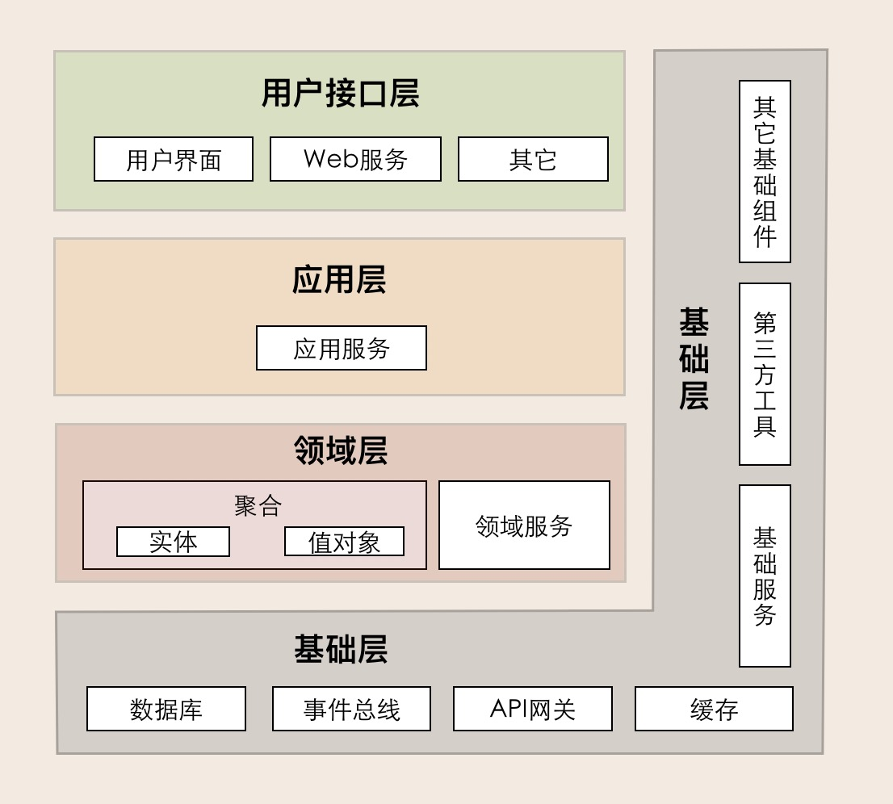

### 1、装饰器模式的好处和原理
1、原理
装饰器模式（Decorator Pattern）是一种 结构型设计模式。

它的核心思想是：在不修改原有类代码的前提下，动态地给对象增加新的功能。

实现方式是通过 组合而不是继承 ——即将原对象作为一个成员变量传入装饰器类中，装饰器类实现与被装饰对象相同的接口，然后在调用方法时，先执行增强逻辑，再委托给原对象执行。
2、好处
遵循开闭原则：对扩展开放，对修改关闭。无需修改原类代码，就能增加新功能。

比继承更灵活：继承会带来类爆炸问题（功能组合太多就要写很多子类），而装饰器模式可以在运行时动态组合多个装饰器。

职责分离，代码复用：每个装饰器类负责一种增强逻辑，多个装饰器可以自由叠加，形成灵活的功能链。

符合面向接口编程：客户端只依赖抽象接口，不关心具体的增强实现。

### 2、为什么不用继承，继承解决不了哪些问题
1）不够灵活，功能组合受限

如果要加两种增强逻辑（比如日志、权限），就需要写三个子类：

只加日志的子类

只加权限的子类

同时加日志和权限的子类

功能一多，就会导致 类爆炸问题。

2）不能运行时动态叠加

继承是在编译期确定的，想在运行时动态选择要不要增强、增强哪些功能，就做不到。

而装饰器模式可以通过组合在运行时灵活拼接。

3）破坏封装，违反开闭原则

修改功能时要改类（新增子类或修改父类），违反“对修改关闭”。

装饰器模式则是“对扩展开放”，只需新增装饰器类即可。

4）继承层级复杂，耦合度高

多层继承会导致类结构僵化，复用性差。

装饰器通过接口 + 组合来解耦，更清晰。

### 3、Cache Aside+延迟双删，为什么要延迟双删
Cache Aside 两种删除模式：
1、先删缓存，后删数据库，可能会存在缓存加载进来旧数据的可能性，之后读的数据全是旧数据。

2、先删数据库，后删缓存：理论上来说还是可能会出现数据不一致性的问题，不过概率非常小，因为缓存的写入速度是比数据库的写入速度快很多。请求1读数据，请求2写数据，请求 1 从 db 读数据 A-> 请求 2 更新 db 中的数据 A（此时缓存中无数据 A ，故不用执行删除缓存操作 ） -> 请求 1 将数据 A 写入 cache。

现在我们再来分析一下 Cache Aside Pattern 的缺陷。

缺陷 1：首次请求数据一定不在 cache 的问题解决办法：可以将热点数据可以提前放入 cache 中。

缺陷 2：写操作比较频繁的话导致 cache 中的数据会被频繁被删除，这样会影响缓存命中率 。解决办法：数据库和缓存数据强一致场景：更新 db 的时候同样更新 cache，不过我们需要加一个锁/分布式锁来保证更新 cache 的时候不存在线程安全问题。可以短暂地允许数据库和缓存数据不一致的场景：更新 db 的时候同样更新 cache，但是给缓存加一个比较短的过期时间，这样的话就可以保证即使数据不一致的话影响也比较小

问题：并发环境下

线程 A（写操作）：更新 DB → 删除缓存

线程 B（读操作）：先读缓存未命中 → 去查 DB（但这时 A 已更新 DB，还没删缓存） → 把旧值写入缓存

### 4、DDD架构的理解
基础的架构如下：

用户接口层就是API层，然后到应用层，应用层编排各种领域服务。领域服务以manager形式的来调聚合，聚合包括实体和值对象。在聚合中声明了repository的接口，然后具体的实现在infra层。

1、用户接口层

用户接口层负责向用户显示信息和解释用户指令。这里的用户可能是：用户、程序、自动化测试和批处理脚本等等。

2、应用层

应用层是很薄的一层，理论上不应该有业务规则或逻辑，主要面向用例和流程相关的操作。但应用层又位于领域层之上，因为领域层包含多个聚合，所以它可以协调多个聚合的服务和领域对象完成服务编排和组合，协作完成业务操作。

此外，应用层也是微服务之间交互的通道，它可以调用其它微服务的应用服务，完成微服务之间的服务组合和编排。

这里我要提醒你一下：在设计和开发时，不要将本该放在领域层的业务逻辑放到应用层中实现。因为庞大的应用层会使领域模型失焦，时间一长你的微服务就会演化为传统的三层架构，业务逻辑会变得混乱。

另外，应用服务是在应用层的，它负责服务的组合、编排和转发，负责处理业务用例的执行顺序以及结果的拼装，以粗粒度的服务通过 API 网关向前端发布。还有，应用服务还可以进行安全认证、权限校验、事务控制、发送或订阅领域事件等。

3、领域层

领域层的作用是实现企业核心业务逻辑，通过各种校验手段保证业务的正确性。领域层主要体现领域模型的业务能力，它用来表达业务概念、业务状态和业务规则。

领域层包含聚合根、实体、值对象、领域服务等领域模型中的领域对象。

这里我要特别解释一下其中几个领域对象的关系，以便你在设计领域层的时候能更加清楚。首先，领域模型的业务逻辑主要是由实体和领域服务来实现的，其中实体会采用充血模型来实现所有与之相关的业务功能。其次，你要知道，实体和领域对象在实现业务逻辑上不是同级的，当领域中的某些功能，单一实体（或者值对象）不能实现时，领域服务就会出马，它可以组合聚合内的多个实体（或者值对象），实现复杂的业务逻辑。

4、基础层

基础层是贯穿所有层的，它的作用就是为其它各层提供通用的技术和基础服务，包括第三方工具、驱动、消息中间件、网关、文件、缓存以及数据库等。比较常见的功能还是提供数据库持久化。

基础层包含基础服务，它采用依赖倒置设计，封装基础资源服务，实现应用层、领域层与基础层的解耦，降低外部资源变化对应用的影响。

比如说，在传统架构设计中，由于上层应用对数据库的强耦合，很多公司在架构演进中最担忧的可能就是换数据库了，因为一旦更换数据库，就可能需要重写大部分的代码，这对应用来说是致命的。那采用依赖倒置的设计以后，应用层就可以通过解耦来保持独立的核心业务逻辑。当数据库变更时，我们只需要更换数据库基础服务就可以了，这样就将资源变更对应用的影响降到了最低。

5、Share层
包含一些每一个服务都要使用的Data对象和抽象的服务，比如对缓存的操作等。

### 5、MVCC底层的原理是什么
背景：MVCC（多版本并发控制）是一种数据库并发控制机制，常用于 MySQL InnoDB。它通过“保存数据的多个版本”来避免加锁，从而实现高并发下的读写隔离。

核心原理：

隐藏字段：每行innoDB数据都会存一些隐藏列，tri_id记录插入/更新该事务的ID，roll_pointer指向undo log，用于回溯旧版本。

undo log：每次更新都会写一条undo log，保存修改前的数据和指向更老版本的指针，形成版本链。

事务快照：
当事务开启时，会生成一个 ReadView，里面记录当前系统活跃事务的 ID 列表。

查询时通过比较 trx_id 与 ReadView：

如果数据的版本是已提交的，且在快照可见范围内 → 可读

如果版本太新（还没提交） → 不可见，要沿着版本链回溯旧值

实现效果：
读已提交 / 可重复读 都是基于 MVCC 来实现的，只是 ReadView 生成的时机不同：

读已提交（RC）：每次读都会生成新的 ReadView

可重复读（RR）：一个事务内共享同一个 ReadView

### 6、不可重复读产生的原因