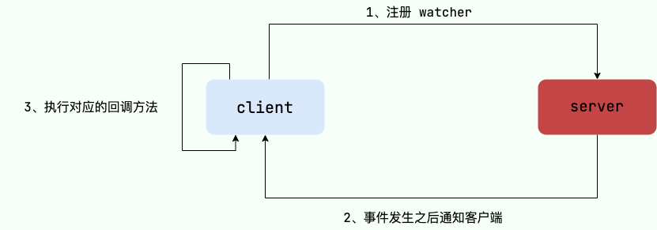

## 总结ZooKeeper

### 概览
ZooKeeper 是一个开源的分布式协调服务，它的设计目标是将那些复杂且容易出错的分布式一致性服务封装起来，构成一个高效可靠的原语集，并以一系列简单易用的接口提供给用户使用。

ZooKeeper 为我们提供了高可用、高性能、稳定的分布式数据一致性解决方案，通常被用于实现诸如数据发布/订阅、负载均衡、命名服务、分布式协调/通知、集群管理、Master 选举、分布式锁和分布式队列等功能。这些功能的实现主要依赖于 ZooKeeper 提供的 数据存储+事件监听 功能（后文会详细介绍到） 

### 特点
- 顺序一致性： 从同一客户端发起的事务请求，最终将会严格地按照顺序被应用到 ZooKeeper 中去。

- 原子性： 所有事务请求的处理结果在整个集群中所有机器上的应用情况是一致的，也就是说，要么整个集群中所有的机器都成功应用了某一个事务，要么都没有应用。

- 单一系统映像： 无论客户端连到哪一个 ZooKeeper 服务器上，其看到的服务端数据模型都是一致的。

- 可靠性： 一旦一次更改请求被应用，更改的结果就会被持久化，直到被下一次更改覆盖。

- 实时性： 一旦数据发生变更，其他节点会实时感知到。每个客户端的系统视图都是最新的。

- 集群部署：3~5 台（最好奇数台）机器就可以组成一个集群，每台机器都在内存保存了 ZooKeeper 的全部数据，机器之间互相通信同步数据，客户端连接任何一台机器都可以。

- 高可用：如果某台机器宕机，会保证数据不丢失。集群中挂掉不超过一半的机器，都能保证集群可用。比如 3 台机器可以挂 1 台，5 台机器可以挂 2 台。

### 应用场景
ZooKeeper 概览中，我们介绍到使用其通常被用于实现诸如数据发布/订阅、负载均衡、命名服务、分布式协调/通知、集群管理、Master 选举、分布式锁和分布式队列等功能。下面选 3 个典型的应用场景来专门说说：
- 命名服务：可以通过 ZooKeeper 的顺序节点生成全局唯一 ID。
- 数据发布/订阅：通过 Watcher 机制 可以很方便地实现数据发布/订阅。当你将数据发布到 ZooKeeper 被监听的节点上，其他机器可通过监听 ZooKeeper 上节点的变化来实现配置的动态更新。
- 分布式锁：通过创建唯一节点获得分布式锁，当获得锁的一方执行完相关代码或者是挂掉之后就释放锁。分布式锁的实现也需要用到 Watcher 机制 

### 数据模型
ZooKeeper 数据模型采用层次化的多叉树形结构，每个节点上都可以存储数据，这些数据可以是数字、字符串或者是二进制序列。并且。每个节点还可以拥有 N 个子节点，最上层是根节点以“/”来代表。每个数据节点在 ZooKeeper 中被称为 znode，它是 ZooKeeper 中数据的最小单元。并且，每个 znode 都有一个唯一的路径标识。

强调一句：ZooKeeper 主要是用来协调服务的，而不是用来存储业务数据的，所以不要放比较大的数据在 znode 上，ZooKeeper 给出的每个节点的数据大小上限是 1M 。

### 数据节点
- 持久（PERSISTENT）节点：一旦创建就一直存在即使 ZooKeeper 集群宕机，直到将其删除。

- 临时（EPHEMERAL）节点：临时节点的生命周期是与 客户端会话（session） 绑定的，会话消失则节点消失。并且，临时节点只能做叶子节点 ，不能创建子节点。

- 持久顺序（PERSISTENT_SEQUENTIAL）节点：除了具有持久（PERSISTENT）节点的特性之外， 子节点的名称还具有顺序性。比如 /node1/app0000000001、/node1/app0000000002 。
- 临时顺序（EPHEMERAL_SEQUENTIAL）节点：除了具备临时（EPHEMERAL）节点的特性之外，子节点的名称还具有顺序性。

每个 znode 由 2 部分组成:
- stat：状态信息
- data：节点存放的数据的具体内容

### ACL权限控制
略

### 版本
在前面我们已经提到，对应于每个 znode，ZooKeeper 都会为其维护一个叫作 Stat 的数据结构，Stat 中记录了这个 znode 的三个相关的版本：
- dataVersion：当前 znode 节点的版本号
- cversion：当前 znode 子节点的版本
- aclVersion：当前 znode 的 ACL 的版本

### Wather(事件监听器)
Watcher（事件监听器），是 ZooKeeper 中的一个很重要的特性。ZooKeeper 允许用户在指定节点上注册一些 Watcher，并且在一些特定事件触发的时候，ZooKeeper 服务端会将事件通知到感兴趣的客户端上去，该机制是 ZooKeeper 实现分布式协调服务的重要特性。

### 会话（Session）
Session 可以看作是 ZooKeeper 服务器与客户端的之间的一个 TCP 长连接，通过这个连接，客户端能够通过心跳检测与服务器保持有效的会话，也能够向 ZooKeeper 服务器发送请求并接受响应，同时还能够通过该连接接收来自服务器的 Watcher 事件通知。

Session 有一个属性叫做：sessionTimeout ，sessionTimeout 代表会话的超时时间。当由于服务器压力太大、网络故障或是客户端主动断开连接等各种原因导致客户端连接断开时，只要在sessionTimeout规定的时间内能够重新连接上集群中任意一台服务器，那么之前创建的会话仍然有效。

另外，在为客户端创建会话之前，服务端首先会为每个客户端都分配一个 sessionID。由于 sessionID是 ZooKeeper 会话的一个重要标识，许多与会话相关的运行机制都是基于这个 sessionID 的，因此，无论是哪台服务器为客户端分配的 sessionID，都务必保证全局唯一。

### ZooKeeper集群
但是，在 ZooKeeper 中没有选择传统的 Master/Slave 概念，而是引入了 Leader、Follower 和 Observer 三种角色。如下图所示

### ZooKeeper集群Leader选举过程
当 Leader 服务器出现网络中断、崩溃退出与重启等异常情况时，就会进入 Leader 选举过程，这个过程会选举产生新的 Leader 服务器。
这个过程大致是这样的：
- Leader election（选举阶段）：节点在一开始都处于选举阶段，只要有一个节点得到超半数节点的票数，它就可以当选准 leader。
- Discovery（发现阶段）：在这个阶段，followers 跟准 leader 进行通信，同步 followers 最近接收的事务提议。
- Synchronization（同步阶段）：同步阶段主要是利用 leader 前一阶段获得的最新提议历史，同步集群中所有的副本。同步完成之后准 leader 才会成为真正的 leader。
- Broadcast（广播阶段）：到了这个阶段，ZooKeeper 集群才能正式对外提供事务服务，并且 leader 可以进行消息广播。同时如果有新的节点加入，还需要对新节点进行同步。

ZooKeeper 集群中的服务器状态有下面几种：
- LOOKING：寻找 Leader。LEADING：Leader 状态，对应的节点为 Leader。
- FOLLOWING：Follower 状态，对应的节点为 Follower。
- OBSERVING：Observer 状态，对应节点为 Observer，该节点不参与 Leader 选举

### ZooKeeper为什么要有单数台机器
ZooKeeper 集群在宕掉几个 ZooKeeper 服务器之后，如果剩下的 ZooKeeper 服务器个数大于宕掉的个数的话整个 ZooKeeper 才依然可用。假如我们的集群中有 n 台 ZooKeeper 服务器，那么也就是剩下的服务数必须大于 n/2。先说一下结论，2n 和 2n-1 的容忍度是一样的，都是 n-1，大家可以先自己仔细想一想，这应该是一个很简单的数学问题了。比如假如我们有 3 台，那么最大允许宕掉 1 台 ZooKeeper 服务器，如果我们有 4 台的的时候也同样只允许宕掉 1 台。 假如我们有 5 台，那么最大允许宕掉 2 台 ZooKeeper 服务器，如果我们有 6 台的的时候也同样只允许宕掉 2 台。综上，何必增加那一个不必要的 ZooKeeper 呢？
### ZooKeeper 选举的过半机制防止脑裂

- 何为集群脑裂？

对于一个集群，通常多台机器会部署在不同机房，来提高这个集群的可用性。保证可用性的同时，会发生一种机房间网络线路故障，导致机房间网络不通，而集群被割裂成几个小集群。这时候子集群各自选主导致“脑裂”的情况。举例说明：比如现在有一个由 6 台服务器所组成的一个集群，部署在了 2 个机房，每个机房 3 台。正常情况下只有 1 个 leader，但是当两个机房中间网络断开的时候，每个机房的 3 台服务器都会认为另一个机房的 3 台服务器下线，而选出自己的 leader 并对外提供服务。若没有过半机制，当网络恢复的时候会发现有 2 个 leader。仿佛是 1 个大脑（leader）分散成了 2 个大脑，这就发生了脑裂现象。脑裂期间 2 个大脑都可能对外提供了服务，这将会带来数据一致性等问题。

- 过半机制是如何防止脑裂现象产生的？

ZooKeeper 的过半机制导致不可能产生 2 个 leader，因为少于等于一半是不可能产生 leader 的，这就使得不论机房的机器如何分配都不可能发生脑裂。
