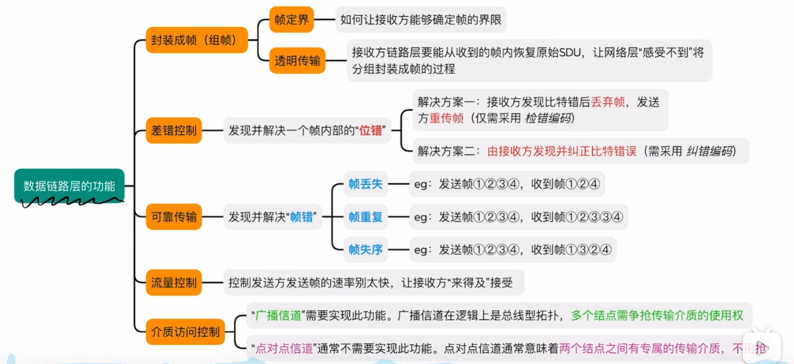

# 计算机网络
## 一、OSI模型
### 1. 物理层
实现相邻节点之间比特的传输

包含如下功能：
1. 需定义电路接口参数(如:形状、尺寸、引脚数等)
2. 需定义传输信号的含义、电气特征(如:5V表示1，1V表示0;每比特电信持续时间0.1ms)

### 2.链路层
确保相邻节点之间的链路逻辑上没有差错，以帧的形式进行传播

包含如下功能：

1. 差错控制：检错+纠错，或者检错+丢弃+重传
2. 流量控制：协调两个节点的速率


### 3. 网络层
把分组从源节点转发到目标节点，以分组Packet的形式进行传播

包含如下功能：
1. 路由选择：维护并构造路由表，决定分组到达目标节点的最佳路径
2. 分组转发：将“分组”从合适的端口转发出去
3. 拥塞控制：发现网络拥塞，并采取措施缓解拥塞
4. 网际互联：实现异构网络互联
5. 其他功能：差错控制，流量控制，连接建立和释放，可靠传输管理
   
### 4.传输层
实现端到端的通信，端指端口以报文段的形式进行传播

包含如下功能：
1. 复用和分用：发送端几个高层实体复用一条低层的额连接，在接收端进行分用
2. 其他功能：差错控制，流量控制，连接建立和释放，可靠传输管理

### 会话层，表示层，应用层
以报文的形式进行传播

会话层：管理进程之间的会话

表示层：解决不同主机信息表示不一致的问题

应用层：实现特定的网络应用

## 二、TCP/IP模型
### 1. 物理层

### 2. 数据链路层

整体思路如下：


#### 组帧

主要问题：

1. 帧定界
2. 透明传输

解决方法：

1. 字符计数法
2. 字节填充法：SOH和EOT
3. 零比特填充法：每次遇到5个1就填个0
4. 违规编码法：帧前后加违规的时钟信号

#### 差错控制
检错：
1. 奇数偶数校验法，增加校验位添加01（偶数校验用异或实现）
2. 循环冗余校验码
纠错：
海明码

#### 流量控制，可靠传输和滑动窗口
- 流量控制
1. 停止-等待协议（Stop-and-Wait ARQ）

    发送窗口 = 1，接收窗口 = 1

    发送方每次只能发送一个数据帧，必须等待该帧的确认（ACK）后才能发送下一个。

    接收方接收到第 i 个帧后，若检测无误，返回 ACK(i)；若超时未收到 ACK，发送方重传该帧。

    由于一次仅发送一帧，因此只需要 1 bit 帧编号（0/1交替使用）。

2. 后退 N 帧协议（Go-Back-N ARQ）

    发送窗口 > 1，接收窗口 = 1

    发送方可以连续发送多个数据帧（最多 N 个），无需等待每帧的确认。

    接收方只按序接收数据帧：

    若收到第 i 帧无误，则返回累积确认 ACK(i)。

    若中间某个帧出错或丢失，则从该帧开始的所有后续帧都被丢弃。

    确认可以 累积确认，即连续接收多个数据帧，只需返回最后一个 ACK。

    若发送方在定时器超时前未收到相应 ACK，则从出错帧开始 重传所有未确认的帧。

    帧编号使用 k bit，编号范围为 0 ～ 2^k − 1。

3. 选择重传协议（Selective Repeat ARQ）

    发送窗口 > 1，接收窗口 > 1

    发送方可以连续发送多个帧，接收方也可以 缓存乱序到达的帧。

    接收方对每个正确接收的帧分别返回 ACK(i)，若某帧出错，仅要求重传该帧。

    因此，发送方只需 选择性重传出错或丢失的帧，无需重传后续所有帧。

    接收方在缓存中可暂存已正确接收但未按序交付的帧，待缺失帧补齐后按序交付给上层。

    帧编号使用 k bit，为了避免确认混淆，发送窗口和接收窗口的大小均为 2^(k−1)。

总结对比如下：
| 协议名称   | 发送窗口 | 接收窗口 | 确认方式 | 出错处理        | 效率 |
| ------ | ---- | ---- | ---- | ----------- | -- |
| 停止-等待  | 1    | 1    | 每帧确认 | 重传当前帧       | 最低 |
| 后退 N 帧 | >1   | 1    | 累积确认 | 出错后重传所有未确认帧 | 较高 |
| 选择重传   | >1   | >1   | 个别确认 | 仅重传出错帧      | 最高 |

#### CSMA CD协议

先听后发，边听边发，冲突停发，随机重发

#### CSMA CA协议
针对WIFI的场景，不能使用CSMA/CD协议，主要是不能监听，所以就要用CA(avoid)协议


信道预约，发送控制帧来预约哪个时间被占用

#### 令牌传递协议
令牌传递协议（Token Passing） 是一种 轮流访问介质的控制协议。
它通过在网络节点之间传递一个特殊的控制帧——“令牌（Token）”，
来控制哪个节点可以发送数据，从而避免冲突。

#### MAC层帧内容


#### VLAN

VLAN 可以把一个物理局域网（LAN）划分为多个逻辑局域网，使得同一物理网络中的不同用户之间像是分属于不同的网络。
``` diff
+-------------------------------+
| 目标MAC | 源MAC | VLAN标记 | 数据 | CRC |
+-------------------------------+
```

#### 以太网交换机
普通二层交换机在转发用户流量时不使用自己的 MAC 地址，

但它拥有 MAC 地址（通常一个或多个），用于设备管理或三层转发功能。

交换机（Switch） 是一种在数据链路层（OSI 第二层）工作的网络设备，用于根据 MAC 地址 转发以太网帧。

它通过构建并维护一张 MAC 地址表（MAC Address Table / CAM Table） 来实现高效的数据帧转发。

| 特点          | 说明                            |
| ----------- | ----------------------------- |
| **工作层次**    | 数据链路层（第二层），有些高端交换机支持第三层（路由功能） |
| **主要作用**    | 根据目标 MAC 地址转发帧，实现局域网内部通信      |
| **转发效率高**   | 采用硬件电路（ASIC）实现转发，比软件路由快       |
| **自学习能力**   | 能自动学习端口与 MAC 地址对应关系           |
| **隔离冲突域**   | 每个端口独立成为一个冲突域，提高带宽利用率         |
| **不隔离广播域**  | 所有端口仍属于同一广播域（除非划分 VLAN）       |
| **支持全双工通信** | 可实现同时发送和接收，无需 CSMA/CD 协议      |

### 3. 网络层
#### IP数据报的内容
``` diff
+------------------------------------------------------------+
| 版本 | 首部长度 | 服务类型 |         总长度                 |
+------------------------------------------------------------+
|            标识              |标志位|    片偏移                |
+------------------------------------------------------------+
| 生存时间 | 协议类型 |       首部校验和                   |
+------------------------------------------------------------+
|                    源 IP 地址                              |
+------------------------------------------------------------+
|                    目的 IP 地址                            |
+------------------------------------------------------------+
|        可选字段 + 填充（如有）                            |
+------------------------------------------------------------+
|                     数据部分（Payload）                    |
+------------------------------------------------------------+

```
#### 子网划分和子网掩码
子网是把一个大的 IP 网络再划分成多个更小的网络。

子网掩码是一种 32 位的数，用来区分“网络号”和“主机号”。
#### CIDR

CIDR（Classless Inter-Domain Routing，无类别域间路由）是为了解决传统 IP 地址分类（A/B/C 类）带来的地址浪费问题而提出的一种 IP 地址分配与路由聚合机制。

CIDR = 灵活划分网络 + 路由聚合机制（减少路由表项，可能会引入无用地址），
通过使用“IP地址/前缀长度”表示网络，
有效节省了地址空间并优化了路由表结构。

#### 最长匹配原则

转发到匹配最长的地址

#### NAT协议
NAT（Network Address Translation） 是一种 在 IP 报文通过路由器或防火墙时，修改其源或目的 IP 地址 的技术。

| 类型                 | 说明          | 举例                               |
| ------------------ | ----------- | -------------------------------- |
| **静态 NAT**         | 一对一映射，固定绑定  | 内网 192.168.1.10 ↔ 公网 203.0.113.5 |
| **动态 NAT**         | 从公网地址池中动态分配 | 内网主机临时获得一个公网 IP                  |
| **NAPT（端口复用 NAT）** | 多对一，通过端口区分  | 家庭路由器常用方式（PAT）                   |


#### ARP协议

ARP（地址解析协议） 是一种 在局域网中根据 IP 地址找到对应 MAC 地址 的协议。

简单说：ARP = IP 地址 → MAC 地址的映射工具

#### DHCP协议
DHCP 是一种 自动为主机分配 IP 地址及网络配置参数 的协议。
属于 应用层协议，基于 UDP 进行通信：

| 方向        | 端口          |
| --------- | ----------- |
| 客户端 → 服务器 | UDP 68 → 67 |
| 服务器 → 客户端 | UDP 67 → 68 |

工作流程：

DORA：Discover → Offer → Request → Acknowledge

1️⃣ DHCP Discover（发现）

客户端广播请求 IP。

客户端刚接入网络，没有 IP，因此发送广播：

源 IP：0.0.0.0
目的 IP：255.255.255.255


内容：“有哪位 DHCP 服务器能给我分配一个 IP？”

🧱 2️⃣ DHCP Offer（提供）

服务器响应并提供一个可用 IP。

DHCP 服务器收到广播后，从地址池中选出一个空闲 IP。

单播或广播给客户端：

提供的 IP：192.168.1.100
子网掩码：255.255.255.0
网关：192.168.1.1
租期：8小时

🧱 3️⃣ DHCP Request（请求）

客户端确认要使用哪个服务器提供的 IP。

如果有多个服务器都 Offer 了，客户端选择一个；

发送广播：

我要使用 DHCP 服务器 192.168.1.1 提供的 IP：192.168.1.100

🧱 4️⃣ DHCP ACK（确认）

服务器正式确认并记录租约。

DHCP 服务器确认后发送 ACK：

恭喜，你的 IP：192.168.1.100
有效期：8小时


客户端更新本地配置，开始使用该 IP。

#### ICMP协议
ICMP协议属于网络层，IP协议为ICMP协议提供服务


#### IPv6协议


#### 路由算法

分层次路由（二层）：在自治系统内部，自由选择路由算法，每个自治系统内部至少要有一台自洽系统边界路由器与其他自洽系统相连，各便捷路由器之间采用统一的外部路由协议，路由算法主要有静态路由算法和动态路由算法

动态路由算法：

RIP算法（距离-向量路由算法）：RIP属于应用层，使用UDP进行传输，RIP（Routing Information Protocol，路由信息协议） 是一种基于距离向量（Distance Vector）的内部网关协议（IGP），用于在一个自治系统（AS）内的路由器之间交换路由信息。它是最早、最简单的动态路由协议之一。RIP 使用“跳数（Hop Count）”作为度量（metric）来衡量到达目标网络的距离：

- 每经过一个路由器（即一跳），跳数加 1。
- 最大跳数为 15，超过 15 跳则认为目的地不可达。

RIP 的基本机制

1. 路由更新广播（Routing Update）
每隔 30 秒，路由器会向邻居广播自己的整个路由表。默认使用 UDP 520 端口。
广播目标地址为：

    IPv4：255.255.255.255

    或多播地址：224.0.0.9（RIPv2）

2. 距离向量算法（Bellman-Ford）
每个路由器保存一张“距离向量表”，记录每个目标网络的：
下一跳地址（Next Hop）
跳数（Metric）
当邻居发来路由表时，比较是否有更短路径，有则更新。

3. 收敛过程
网络发生变化（如链路断开）时，RIP 通过周期性更新和“抑制机制”逐步收敛。
因此，RIP 适合小型网络，不适合大型网络（因为路由路径不能超过 15 跳）。

优点：

- 简单易实现，配置方便

- 占用系统资源少

- 适合小型局域网或教学使用

- 好消息传得快

缺点：
- 收敛慢

- 不支持大规模网络（跳数限制 15）

- 不支持复杂拓扑

- 更新周期固定，占带宽

- 坏消息传的慢

OSPFS算法(链路状态路由算法)：
OSPF 的作用是：在一个自治系统（AS）内，通过链路状态算法（Link State Algorithm）计算出每个路由器到达所有网络的最短路径。它直接负责“路由选择（Routing）”这一网络层的核心功能。因此，功能上明确属于网络层。，建立整个网络的拓扑结构图，工作在网络层

每台 OSPF 路由器都会：

- 发现邻居（Neighbor Discovery）

- 建立邻接关系（Adjacency）

- 泛洪（Flooding）链路状态信息（LSA） 给整个区域内的其他路由器

所有路由器根据相同的 链路状态数据库（LSDB），独立运行 Dijkstra 最短路径算法（SPF），计算出到各网段的最优路径。

主要特点：
| 特点                   | 说明                                              |
| -------------------- | ----------------------------------------------- |
| **1️⃣ 快速收敛**         | 链路状态变化会立即触发 LSA 泛洪，快速更新网络拓扑                     |
| **2️⃣ 无跳数限制**        | 使用“代价（Cost）”作为度量，通常与带宽相关                        |
| **3️⃣ 支持层次化结构**      | 使用“区域（Area）”划分自治系统，减少路由表规模                      |
| **4️⃣ 支持认证机制**       | 可使用明文或 MD5 验证邻居合法性                              |
| **5️⃣ 多播更新**         | 使用多播地址 224.0.0.5（所有 OSPF 路由器）和 224.0.0.6（指定路由器） |
| **6️⃣ 支持 VLSM/CIDR** | 支持无类域间路由（Classless Inter-Domain Routing）        |


报文分组类型：
| 类型编号  | 分组名称（Packet Type）                       | 作用               |
| ----- | --------------------------------------- | ---------------- |
| **1** | **Hello** 报文                            | 建立和维护邻居关系        |
| **2** | **Database Description（DBD）** 报文        | 交换路由数据库概要信息      |
| **3** | **Link State Request（LSR）** 报文          | 请求对方发送指定的链路状态信息  |
| **4** | **Link State Update（LSU）** 报文           | 发送具体的链路状态信息（LSA） |
| **5** | **Link State Acknowledgment（LSAck）** 报文 | 确认收到的链路状态更新（LSU） |


BGP算法（路径向量路由算法）：

### 4. 传输层
#### UDP协议
- UDP首部很小，只占8B；
- UDP每次传输一个完整的报文，不支持报文自动拆分、重装UDP
- 是无连接的、不可靠的(可靠性可以交给应用层处理)，也不支持拥塞控制
- UDP支持一对一(封装成单播IP数据报)、一对多（传输封装成广播/多播IP数据报）

发送方添加伪首部计算校验和，然后接收方也添加伪首部进行校验，如果全1就是正确的报文

``` lua
  0      7 8     15 16    23 24    31
 +--------+--------+--------+--------+
 |   源端口号     |   目的端口号     |
 +--------+--------+--------+--------+
 |   长度         |    校验和        |
 +--------+--------+--------+--------+
 |          数据（Data）              |
 +-----------------------------------+

```

#### TCP协议
- TCP首部更大，占20~60B
- TCP支持报文自动拆分、重装，因此可以传输长报文
- TCP是有连接的、可靠的、支持拥塞控制
- TCP仅支持一对一传输(因为通信双方的传输层必须先建立连接)

``` lua
  0      7 8     15 16    23 24    31
 +--------+--------+--------+--------+
 |   源端口号     |   目的端口号     |
 +--------+--------+--------+--------+
 |         序号（Sequence Number）   |
 +-----------------------------------+
 |       确认号（Acknowledgment）    |
 +--------+--------+--------+--------+
 | 数据偏移 | 保留 | 控制位 | 窗口大小 |
 +--------+--------+--------+--------+
 |   校验和        | 紧急指针（Urgent）|
 +--------+--------+--------+--------+
 |    可选项（Options）    |  数据  |
 +-----------------------------------+

```

URG: 紧急指针有效，表示是紧急数据需要处理
PSH: 表示希望尽快收到对方回复，用于交互式通信
RST: RST为1时，表示出现严重差错，如主机崩溃，必须释放连接
SYN: =1时，表示此报文是连接请求报文或者连接接受报文，握手1 2
FIN: =1时，要求释放连接 回收1 3

累积确认：攒够0.5s后再进行一次确认

捎带确认：再确定的时候携带数据

1. 可靠传输的关键机制
   

- 三次握手
- 序列号机制
- 超时重传机制
- 快速重传
- 滑动窗口
- 拥塞控制
- 数据校验
- 四次挥手断开连接

| 机制        | 作用        |
| --------- | --------- |
| 三次握手      | 确保连接可靠建立  |
| 序列号 / ACK | 确保数据有序与确认 |
| 超时重传      | 避免数据丢失    |
| 快速重传      | 提高重传效率    |
| 滑动窗口      | 流量控制      |
| 拥塞控制      | 防止网络拥堵    |
| 校验和       | 保证数据正确性   |
| 四次挥手      | 可靠断开连接    |

2. TCP拥塞控制

“TCP 拥塞控制（Congestion Control）”是 TCP 协议实现可靠传输中非常核心的一部分，目标是：

⚙️ 防止网络中的路由器或链路过载导致丢包与延迟，从而保证整体网络的稳定与公平。

- 慢启动

刚开始不知道网络容量，先慢慢探测。初始时：cwnd = 1 MSS（一个最大报文段），每收到一个 ACK，就 cwnd += 1（指数增长），当 cwnd 达到一个阈值（ssthresh，慢启动阈值）后，进入“拥塞避免”阶段。

- 拥塞避免

防止 cwnd 增长过快导致拥塞。当 cwnd >= ssthresh 时，不再指数增长，而是线性增长，每经过一个 RTT，cwnd += 1

- 快速重传 
  
当发送方收到 三个重复的 ACK（ACK 相同） 时，说明有报文丢失。
此时无需等待超时，立即重传丢失的数据段。

快速恢复（Fast Recovery）

配合快速重传使用，不进入慢启动，而是直接减半 cwnd，避免速率骤降。

完整流程：

```
        拥塞窗口 cwnd
              |
              ↓
         ┌────────────┐
         │ 慢启动阶段 │
         └────────────┘
             cwnd < ssthresh
                ↑     ↓
                │     └─ cwnd >= ssthresh
                │
         ┌────────────┐
         │ 拥塞避免阶段 │
         └────────────┘
                ↓
         发生丢包？
           │
   ┌───────┴────────┐
   │                 │
超时重传        快速重传+快速恢复
   │                 │
cwnd=1 MSS         cwnd=ssthresh
重新慢启动         进入拥塞避免

```

### 5. 应用层
#### 1. HTTP 
略
